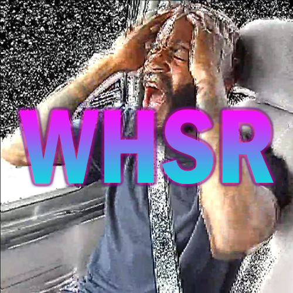

# WHSR - Windows Hardware Sound Replacer

**WHSR** is a portable script that replaces the ***Device Connect*** and ***Device Disconnect*** system sounds on Windows 10 with *Death Grips'* vocal chants **YUH** and **AHH**. 
It is a perfect tool to prank your friends as the WHSR folder can sit on your USB flash drive and requires only a few seconds of distraction.
The script was expanded to also replace ***Windows Notify System Generic***, ***Windows Background***, and ***Windows Recycle*** sounds.

See script in action: [YouTube link](https://www.youtube.com/watch?v=OIoVlY8HaHw)

# Scripts
##### load.bat
  - Elevate permissions to Administrator
  - Unblock .wav files
  - Copy .wav files to *C:/Windows/Media*
  - Set new sounds through registry edit

##### unload.bat
  - Elevate permissions to Administrator
  - Set default sounds through registry edit
  - Remove .wav files from *C:/Windows/Media*
 
# Customization
To use custom sounds, replace the ***.wav*** files in the root folder with your own files. As long as you keep the name and format identical, the script will use corresponding sounds.